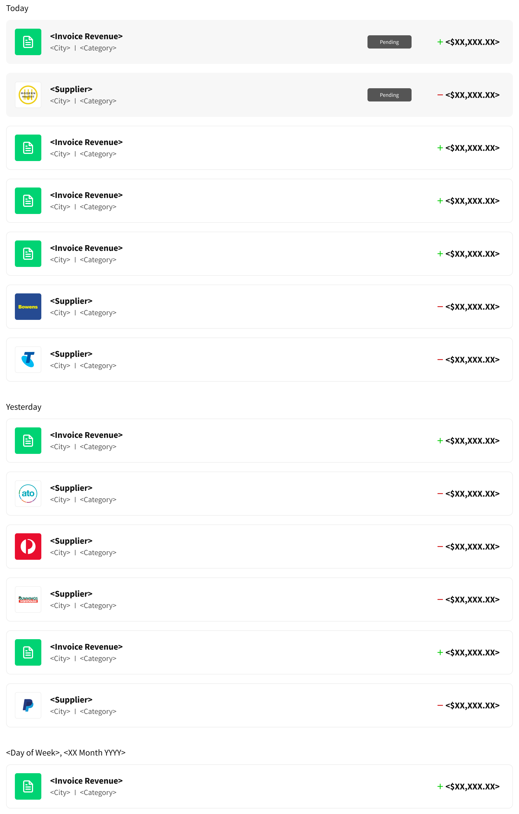
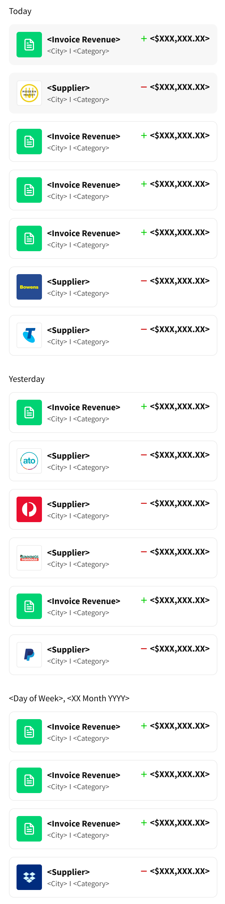
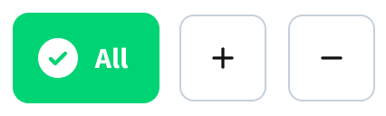

# Thriday Front End Technical Challenge

Live demo: [Click here for live demo](https://67d7ba8291f46d87280f989f--exquisite-lily-dae325.netlify.app/)
Jump to [Project Implementation](#project-implementation)

## Introduction

Our React technical interview process involves candidates doing an at-home project to test your React knowledge and problem solving abilities, while also giving you a chance to write code in a way that you find comfortable.
Using Google/StackOverflow/whatever for help is allowed, but ultimately you should write and be able to justify every piece of the code being submitted.
Your solution should be shared on a public Github or Bitbucket repo showing all commit history.

## Requirements

- Use React
- Use TypeScript
- Think about the use of state management and props, as well as component abstraction (i.e. breaking down the UI into a set of reusable components)
- Don't worry about testing this in multiple browsers; just use whichever one you're most comfortable with, and let us know so we can test in the same one

## The Challenge

We have [provided a JSON file](data/db.json) that powers a mock API (see [available scripts](#available-scripts) for instructions on running the mock API); it contains a list of Transactions.

### Step 1

Using the data from the API, create React components that implement the Transaction list shown in the following desktop/mobile designs:

| Breakpoint | Design                                                     |
| ---------- | ---------------------------------------------------------- |
| Desktop    |  |
| Mobile     |   |

### Step 2

Implement a toolbar with 3 buttons to filter the list of Transactions:

- All
- Income
- Expense



### Assets

- You can find [the designs on Figma](<https://www.figma.com/design/CkejoJbdFNwKJGv0aBSzWE/Transactions-(Dev-test)?m=auto&t=8AccDG8Ku6jzoTzD-6>).

### Acceptance Criteria

#### Step 1

The list of transactions should be grouped by date (the "date" property).

Each group of transactions should display a title showing the date of the group (don't worry about handling the "Today" and "Yesterday" titles).

All Transactions should display:

- a logo (the "logoUrl" property)
- a title (the "transactionTitle" property)
- a subtitle
  - the "suburb" property, if it has a value
  - the "shortCategory" property, if it has a value
  - if both properties have values, display a separator between them
- an amount (the "amount" property)
  - styled differently based on the "cashflow" property
    - when cashflow == "inflow"
      - prefix with green "+"
    - when cashflow == "outflow"
      - prefix with red "-"
- There is no need to implement the "Pending"/"Bookkeeping in progress" states as shown in some of the designs.

#### Step 2

The 3 toolbar buttons are mutually exclusive; only one can be selected at a time. The "All" button should be selected by default.

When a button is selected, the list of transactions should be filtered to only show transactions that match the selected filter.

The "All" filter should show all transactions.

The "Income" filter should show only transactions with a "cashflow" of "inflow".

The "Expense" filter should show only transactions with a "cashflow" of "outflow".

When a button is selected, the background colour should be green and the text colour should be white.
When not selected, the background should be white and the text should be black.
The check icon is only shown on the "All" button, and only when the button is selected.
We have also provided SVG icons for the Income and Expense buttons.

# Project Implementation

## Component Structure

I've organized the application into the following component hierarchy:

- **App**: The main application container
- **TransactionsList**: Container component that manages fetching data and filtering
- **Toolbar**: Displays filter buttons (All, Income, Expense)
- **TransactionGroup**: Groups transactions by date with a date header
- **TransactionItem**: Individual transaction display with logo, title, subtitle, and amount

## Technical Approach

1. **State Management**: Used React hooks for state management, with a custom `useTransactions` hook that handles data fetching, filtering, and organizing transactions by date.

2. **Component Design**: Components are designed to be reusable and follow a clear separation of concerns. Each component has its own CSS file for styling.

3. **Responsive Design**: The application is fully responsive, with different layouts for desktop and mobile as shown in the designs.

4. **TypeScript**: Strong typing is implemented throughout the application to ensure type safety and better developer experience.

5. **Filter Implementation**: The toolbar provides mutually exclusive filter options, with state management handled by the custom hook.

## Features Implemented

- [x] Transaction list grouped by date
- [x] Each transaction displays logo, title, subtitle, and amount
- [x] Amount is styled differently based on cashflow type (inflow/outflow)
- [x] Filter toolbar with All, Income, and Expense options
- [x] Responsive design for both desktop and mobile views
- [x] Error and loading states

## Design Decisions

1. **Custom Hook for Data Management**: Created a custom hook to encapsulate all data fetching and manipulation logic, making the components cleaner and more focused on presentation.

2. **Component Composition**: Used component composition to build complex UI from smaller, reusable pieces that each have a single responsibility.

3. **Styling Approach**: Used component-specific CSS files to scope styles to their particular components, preventing style leakage.

4. **Error Handling**: Implemented proper error handling and loading states to provide feedback to users during data fetching.

## Running the Project

To run the application locally:

1. **Install dependencies**:

   ```
   npm install
   ```

2. **Start the mock API server**:

   ```
   npm run api
   ```

   This will start the JSON server on port 3004.

3. **Start the development server**:

   ```
   npm run dev
   ```

   This will start the application in development mode on port 3000.

4. **Open in browser**:
   Open [http://localhost:3000](http://localhost:3000) to view the application.

## Available Scripts

In the project directory, you can run:

### `npm run dev`

Runs the app in the development mode.\
Open [http://localhost:3000](http://localhost:3000) to view it in your browser.

The page will reload when you make changes.

### `npm run api`

Runs the mock API server.\
Open [http://localhost:3004](http://localhost:3004) to view it in your browser.

**List**

Get a list of all Transactions
http://localhost:3004/transactions

**Paginate**

Use \_page and optionally \_limit to paginate returned data.

```
GET /transactions?_page=3
```

```
GET /transactions?_page=3&_limit=20
```

_10 items are returned by default_

**Filtering**

You can filter the data by particular attributes via query string parameters.

http://localhost:3004/transactions?cashflow=outflow# thriday_fe_code_challenge
